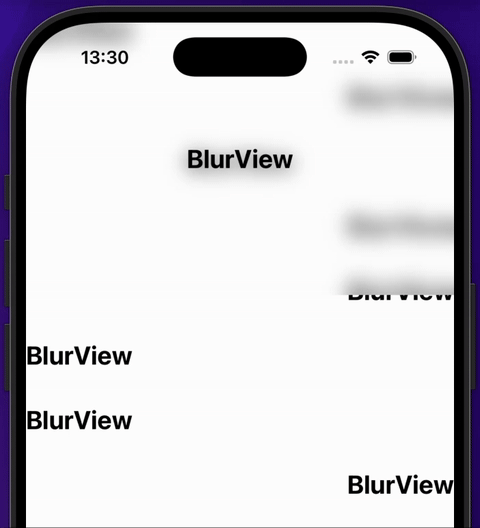
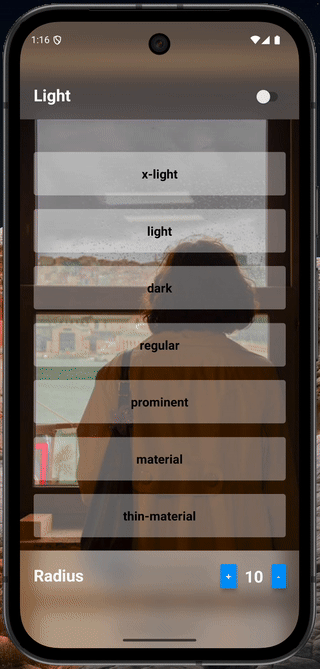

# `@danielsaraldi/react-native-blur-view` 🌫️

A simple blur view in react native based in [`@react-native-community/blur`](https://github.com/Kureev/react-native-blur).

<div align="center">
  <p>
    
    
  </p>
</div>

> [!WARNING]
> This package supports **only** [new architecture](https://reactnative.dev/blog/2024/10/23/the-new-architecture-is-here).

<p align="center">
  
  
</p>

## Summary

- [Installation](#installation)
- [Usage](#usage)
- [Components](#components)
  - [`BlurView`](#blurview)
    - [Properties](#properties)
    - [Blur Types](#blur-types)
  - [`BlurTarget`](#blurtarget)
    - [Properties](#properties-1)
- [Platform Differences](#platform-differences)
  - [Android](#android)
  - [iOS](#ios)
- [Expo](#expo)
- [TypeScript Support](#typescript-support)
- [Contributing](#contributing)
- [License](#license)

## Installation

```sh
npm install @danielsaraldi/react-native-blur-view
# or
yarn add @danielsaraldi/react-native-blur-view
```

Install native dependencies (**iOS only**):

```sh
cd ios && pod install && cd ..
```

## Usage

```tsx
import { BlurView, BlurTarget } from '@danielsaraldi/react-native-blur-view';

export default function App() {
  // ...

  return (
    <>
      <BlurView targetId="target" style={styles.blurView}>
        <Text style={styles.title}>BlurView</Text>
      </BlurView>

      <BlurTarget id="target" style={styles.main}>
        <ScrollView
          style={styles.main}
          contentContainerStyle={styles.content}
          showsVerticalScrollIndicator={false}
        >
          {/* ... */}
        </ScrollView>
      </BlurTarget>
    </>
  );
}

export const styles = StyleSheet.create({
  blurView: {
    position: 'absolute',

    width: '100%',
    height: 256,

    justifyContent: 'center',
    alignItems: 'center',
  },

  title: {
    fontSize: 24,
    fontWeight: 'bold',

    color: 'white',
  },

  main: {
    flex: 1,
  },

  content: {
    padding: 20,

    gap: 8,
  },
});
```

If you are using [@react-navigation/bottom-tabs](https://reactnavigation.org/docs/bottom-tab-navigator/) with blur, all screens that the bottom tabs will navigate must contain a `BlurTarget` as a parent component on them. An example below:

```tsx
// screens/MyScreen.tsx
import { useNavigation } from '@react-navigation/native';
import { BlurTarget } from '@danielsaraldi/react-native-blur-view';

export function MyScreen() {
  const { getState } = useNavigation();

  const pageIndex = getState()?.index?.toString() || '0';

  // ...

  return (
    <BlurTarget id={pageIndex} style={styles.container}>
      {/* ... */}
    </BlurTarget>
  );
}
```

```tsx
// components/MyCustomTabs.tsx
import type { BottomTabBarProps } from '@react-navigation/bottom-tabs';
import { BlurView } from '@danielsaraldi/react-native-blur-view';

export function MyCustomTabs(props: BottomTabBarProps) {
  const { state } = props;

  const pageIndex = state.index.toString();

  // ...

  return (
    <View style={styles.container}>
      <BlurView targetId={pageIndex} style={styles.content}>
        {/* ... */}
      </BlurView>
    </View>
  );
}
```

The `MyCustomTabs` component must be used in the `tabBar` property of the `Navigator`'s bottom tabs. Notice that the `targetId` of the `MyScreen` screen **references** the `id` in the custom bottom tab component.

The target value **must be updated every time** a new screen is rendered, so we've used the page index in this example. However, you can explore other approaches, so feel free to do so.

**Note**: We **don't yet** have full support for nested tabs.

## Components

### `BlurView`

The `BlurView` component is an extends the same properties of the a `View` component.

#### Properties

| Property   | Description                            | Default     | Platform |
| ---------- | -------------------------------------- | ----------- | -------- |
| `targetId` | Id of the target that will be blurred. | `undefined` | Android  |
| `type`     | Color type of the overlay.             | `light`     | All      |
| `radius`   | Blur radius `0` - `100`.               | `10`        | All      |
| `style`    | The View style.                        | `undefined` | All      |

An important detail, when a value less than `0` or greater than `100` are provided for `radius` property, the `radius` is clipped.

#### Blur Types

| Property                    | Description                                                                                                                                               | Platform |
| --------------------------- | --------------------------------------------------------------------------------------------------------------------------------------------------------- | -------- |
| `x-light`                   | The area of the view is lighter than the underlying view.                                                                                                 | All      |
| `light`                     | The area of the view is the same approximate lightness of the underlying view.                                                                            | All      |
| `dark`                      | The area of the view is darker than the underlying view.                                                                                                  | All      |
| `regular`                   | A regular blur style that adapts to the user interface style. Radius **doesn't apply** to this. (**iOS >= 10**)                                           | All      |
| `prominent`                 | A blur style for making content more prominent that adapts to the user interface style. Radius **doesn't apply** to this. (**iOS >= 10**)                 | All      |
| `chrome-material`           | An adaptable blur effect that creates the appearance of the system chrome. Radius **doesn't apply** to this. (**iOS >= 13**)                              | All      |
| `material`                  | An adaptable blur effect that creates the appearance of a material with normal thickness. Radius **doesn't apply** to this. (**iOS >= 13**)               | All      |
| `thick-material`            | An adaptable blur effect that creates the appearance of a material that’s thicker than normal. Radius **doesn't apply** to this. (**iOS >= 13**)          | All      |
| `thin-material`             | An adaptable blur effect that creates the appearance of a thin material. Radius **doesn't apply** to this. (**iOS >= 13**)                                | All      |
| `ultra-thin-material`       | An adaptable blur effect that creates the appearance of an ultra-thin material. Radius **doesn't apply** to this. (**iOS >= 13**)                         | All      |
| `chrome-material-light`     | A blur effect that creates the appearance of the system chrome and is always light. Radius **doesn't apply** to this. (**iOS >= 13**)                     | All      |
| `material-light`            | A blur effect that creates the appearance of a material with normal thickness and is always light. Radius **doesn't apply** to this. (**iOS >= 13**)      | All      |
| `thick-material-light`      | A blur effect that creates the appearance of a material that’s thicker than normal and is always light. Radius **doesn't apply** to this. (**iOS >= 13**) | All      |
| `thin-material-light`       | A blur effect that creates the appearance of a thin material and is always light. Radius **doesn't apply** to this. (**iOS >= 13**)                       | All      |
| `ultra-thin-material-light` | A blur effect that creates the appearance of an ultra-thin material and is always light. Radius **doesn't apply** to this. (**iOS >= 13**)                | All      |
| `chrome-material-dark`      | A blur effect that creates the appearance of the system chrome and is always dark. Radius **doesn't apply** to this. (**iOS >= 13**)                      | All      |
| `material-dark`             | A blur effect that creates the appearance of a material with normal thickness and is always dark. Radius **doesn't apply** to this. (**iOS >= 13**)       | All      |
| `thick-material-dark`       | A blur effect that creates the appearance of a material that’s thicker than normal and is always dark. Radius **doesn't apply** to this. (**iOS >= 13**)  | All      |
| `thin-material-dark`        | A blur effect that creates the appearance of a thin material and is always dark. Radius **doesn't apply** to this. (**iOS >= 13**)                        | All      |
| `ultra-thin-material-dark`  | A blur effect that creates the appearance of an ultra-thin material and is always dark. Radius **doesn't apply** to this. (**iOS >= 13**)                 | All      |

### `BlurTarget`

The `BlurTarget` component is an extends the same properties of the a `View` component.

This component is exclusive and mandatory for **Android**. It's useful because we use [Dimezis's 3v library](https://github.com/Dimezis/BlurView) to apply the blur effect, so its implementation is slightly different than on iOS. On iOS the `BlurTarget` component is a common `View`.

The `BlurTarget` may not contain a `BlurView` that targets the same `BlurTarget`. The `BlurTarget` may contain other `BlurTargets` and `BlurViews` though.

#### Properties

| Property | Description                                       | Platform |
| -------- | ------------------------------------------------- | -------- |
| `id`     | Id of this target to be identified by `BlurView`. | Android  |

## Platform Differences

### Android

On Android platforms, the component utilizes the [BlurView](https://github.com/Dimezis/BlurView) library to offer native blur effects with hardware-accelerated rendering. Support the animation transitions with [react-native-screens](https://github.com/software-mansion/react-native-screens), [react-native-navigation](https://wix.github.io/react-native-navigation) and Modals 😁.

### iOS

On iOS all types are supported by default. However, on Android they are RGBA colors to simulate the same blur color.

## Expo

In Expo, you need to convert to a [custom development build](https://docs.expo.dev/develop/development-builds/introduction/) or use [prebuild](https://docs.expo.dev/workflow/continuous-native-generation/). You can use also React Native without Expo.

## TypeScript Support

Full TypeScript support with proper type definitions!

```ts
import {
  BlurViewType,
  BlurViewProps,
  BlurTargetProps,
} from '@danielsaraldi/react-native-blur-view';

export const INITIAL_BLUR_TYPE: BlurViewType = 'x-light';

export interface CustomBlurViewProps extends BlurViewProps {
  // ...
}

export interface CustomBlurTargetProps extends BlurTargetProps {
  // ...
}
```

## Contributing

See the [contributing guide](CONTRIBUTING.md) to learn how to contribute to the repository and the development workflow.

## License

MIT

---

Made with [create-react-native-library](https://github.com/callstack/react-native-builder-bob) and using the [BlurView](https://github.com/Dimezis/BlurView) library of the [Dimezis](https://github.com/Dimezis) on Android ❤️
