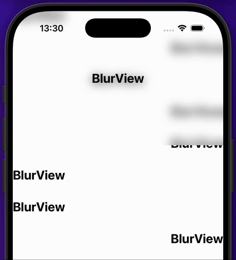
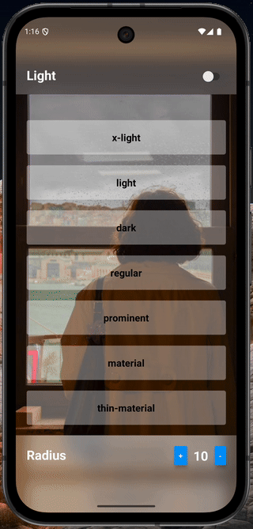

# `@danielsaraldi/react-native-blur-view` 🌫️

A simple blur view in react native based in [`@react-native-community/blur`](https://github.com/Kureev/react-native-blur).

Support the animation transitions with [react-native-screens](https://github.com/software-mansion/react-native-screens), [react-native-navigation](https://wix.github.io/react-native-navigation) and Modals 😁.

<div align="center">
  <p>
    
    
  </p>
</div>

> [!NOTE]
> This package supports **only** [new architecture](https://reactnative.dev/blog/2024/10/23/the-new-architecture-is-here).

<p align="center">
  
  
</p>

## Summary

- [Installation](#installation)
- [Usage](#usage)
  - [Using `ScrollView`/`FlatList`](#using-scrollviewflatlist)
  - [Using `Modal`](#using-modal)
  - [Using `ImageBackground`](#using-imagebackground)
- [Components](#components)
  - [`BlurView`](#blurview)
    - [Properties](#properties)
  - [`BlurTarget`](#blurtarget)
    - [Properties](#properties-1)
  - [`VibrancyView`](#vibrancyview)
    - [Properties](#properties-2)
- [Types](#types)
  - [Blur Types](#blur-types)
- [Migrate to 2.x](#migrate-to-2x)
  - [Why This Change?](#why-this-change)
- [Platform Differences](#platform-differences)
  - [Android](#android)
  - [iOS](#ios)
- [Expo](#expo)
- [TypeScript Support](#typescript-support)
- [Others Libraries](#others-libraries)
- [Contributing](#contributing)
- [License](#license)

## Installation

```sh
npm install @danielsaraldi/react-native-blur-view
# or
yarn add @danielsaraldi/react-native-blur-view
# or
pnpm add @danielsaraldi/react-native-blur-view
# or
bun add @danielsaraldi/react-native-blur-view
```

Install native dependencies (**iOS only**):

```sh
cd ios && pod install && cd ..
```

## Usage

```tsx
import { useRef } from 'react';
import { ScrollView, View } from 'react-native';
import {
  BlurView,
  BlurTarget,
  VibrancyView,
} from '@danielsaraldi/react-native-blur-view';
// ...

export default function App() {
  const targetRef = useRef<View | null>(null);
  // ...

  return (
    <>
      <BlurView blurTarget={targetRef} style={styles.blurView}>
        <Text style={styles.title}>BlurView</Text>
      </BlurView>

      <VibrancyView style={styles.vibrancyView}>
        <Text style={styles.title}>VibrancyView</Text>
      </VibrancyView>

      <BlurTarget ref={targetRef} style={styles.main}>
        <ScrollView
          style={styles.main}
          contentContainerStyle={styles.content}
          showsVerticalScrollIndicator={false}
        >
          {/* ... */}
        </ScrollView>
      </BlurTarget>
    </>
  );
}

export const styles = StyleSheet.create({
  blurView: {
    position: 'absolute',
    top: 0,

    width: '100%',
    height: 256,

    justifyContent: 'center',
    alignItems: 'center',
  },

  vibrancyView: {
    position: 'absolute',
    top: 256,

    width: '100%',
    height: 256,

    justifyContent: 'center',
    alignItems: 'center',
  },

  title: {
    fontSize: 24,
    fontWeight: 'bold',

    color: 'white',
  },

  main: {
    flex: 1,
  },

  content: {
    padding: 20,

    gap: 8,
  },
});
```

### Using `ScrollView`/`FlatList`

You must add `BlurView` elements inside of the list (`ScrollView`/`FlatList`), and the content behind should be added as child of the `BlurTarget` component. Check it below:

```tsx
import { useRef } from 'react';
import { ImageBackground, ScrollView, Text, View } from 'react-native';
import { BlurView, BlurTarget } from '@danielsaraldi/react-native-blur-view';
// ...

export function MyScreen() {
  const targetRef = useRef<View | null>(null);
  // ...

  return (
    <View style={styles.expand}>
      <BlurTarget ref={targetRef} style={styles.blurTarget}>
        <ImageBackground
          style={styles.background}
          source={BACKGROUND}
          resizeMode="cover"
        />
      </BlurTarget>

      <ScrollView
        style={styles.container}
        contentContainerStyle={styles.contentContainer}
        showsVerticalScrollIndicator={false}
      >
        <BlurView blurTarget={targetRef} style={styles.blurView}>
          <Text style={styles.title}>BlurView 1</Text>
        </BlurView>

        <BlurView blurTarget={targetRef} style={styles.blurView}>
          <Text style={styles.title}>BlurView 2</Text>
        </BlurView>

        <BlurView blurTarget={targetRef} style={styles.blurView}>
          <Text style={styles.title}>BlurView 3</Text>
        </BlurView>

        {/* ... */}
      </ScrollView>
    </View>
  );
}
```

### Using `Modal`

You must add `BlurTarget` as a parent of content screen because it will be the **target** of blur, the `BlurView` component must be to used inside of `Modal` to blur effect works correctly.

```tsx
import { useRef, useState } from 'react';
import { Modal, View } from 'react-native';
import { BlurTarget, BlurView } from '@danielsaraldi/react-native-blur-view';
// ...

export function MyScreen() {
  const [isOpenModal, setIsOpenModal] = useState<boolean>(false);
  const targetRef = useRef<View | null>(null);
  // ...

  return (
    <>
      <Modal
        transparent
        statusBarTranslucent
        navigationBarTranslucent
        hardwareAccelerated
        visible={isOpenModal}
        onRequestClose={() => setIsOpenModal(false)}
        style={StyleSheet.absoluteFillObject}
      >
        <BlurView
          blurTarget={targetRef}
          style={StyleSheet.absoluteFillObject}
        />

        <View style={styles.modalContent}>{/* ... */}</View>
      </Modal>

      <BlurTarget ref={targetRef} style={styles.blurTarget}>
        {/* ... */}
      </BlurTarget>
    </>
  );
}
```

### Using `ImageBackground`

You must add `BlurTarget` as a parent of `ImageBackground` because it will be the **target** of blur, the `BlurView` component must be to used as **brother** of `BlurTarget` to blur effect works correctly.

```tsx
import { useRef } from 'react';
import { ImageBackground, View } from 'react-native';
import { BlurTarget, BlurView } from '@danielsaraldi/react-native-blur-view';
// ...

export function MyScreen() {
  const targetRef = useRef<View | null>(null);
  // ...

  return (
    <>
      <View style={styles.blurViewWrapper}>
        <BlurView
          blurTarget={targetRef}
          style={styles.blurView}
          downscaleFactor={4}
        >
          {/** ... **/}
        </BlurView>
      </View>

      <BlurTarget ref={targetRef} style={styles.blurTarget}>
        <ImageBackground
          style={styles.background}
          source={{ uri: 'https://picsum.photos/seed/picsum/600/900' }}
          resizeMode="cover"
        />
      </BlurTarget>
    </>
  );
}
```

## Components

### `BlurView`

The `BlurView` component is an extends the same properties of the a `View` component. The `blurTarget` prop is **required** for Android blur effect works correctly.

#### Properties

| Property                           | Description                                                                                 | Default     | Platform |
| ---------------------------------- | ------------------------------------------------------------------------------------------- | ----------- | -------- |
| `blurTarget`                       | Ref of the `BlurTarget` component to be identified by the `BlurView` component in the tree. | `undefined` | Android  |
| `type`                             | [Blur type](#blur-types) of the overlay.                                                    | `light`     | All      |
| `radius`                           | Blur radius `0` - `100`.                                                                    | `10.0`      | All      |
| `downscaleFactor`                  | Downscale factor `0` - `100`.                                                               | `6.0`       | Android  |
| `overlayColor`                     | Add the overlay color about component.                                                      | `undefined` | All      |
| `reducedTransparencyFallbackColor` | Background color about blur effect when reduced transparency is enabled.                    | `white`     | iOS      |

When a value less than `0` or greater than `100` are provided for `radius` or `downscaleFactor` property, the value is clipped.

### `BlurTarget`

The `BlurTarget` component is an extends the same properties of the a `View` component.

This component is available for **Android only**. It's useful because we use [Dimezis's 3v library](https://github.com/Dimezis/BlurView) to apply the blur effect, so its implementation is slightly different than on iOS. The `BlurTarget` component is a common `View` in iOS.

The `BlurTarget` may not contain a `BlurView` that targets the same `BlurTarget`. The `BlurTarget` may contain other `BlurTargets` and `BlurViews` though.

#### Properties

| Property | Description                                                                                 | Default     | Platform |
| -------- | ------------------------------------------------------------------------------------------- | ----------- | -------- |
| `ref`    | Ref of the `BlurTarget` component to be identified by the `BlurView` component in the tree. | `undefined` | Android  |

### `VibrancyView`

The `VibrancyView` component is an extends the same properties of the a `View` component.

This component is available for **iOS only**. It apply a vibrancy effect in children content. On Android the `VibrancyView` component is a common `View`. It's available for **iOS >= 13**.

#### Properties

| Property                           | Description                                                                  | Default     | Platform |
| ---------------------------------- | ---------------------------------------------------------------------------- | ----------- | -------- |
| `type`                             | [Blur type](#blur-types) of the overlay.                                     | `light`     | All      |
| `radius`                           | Blur radius `0` - `100`.                                                     | `10`        | All      |
| `overlayColor`                     | Add the overlay color about component.                                       | `undefined` | All      |
| `reducedTransparencyFallbackColor` | Background color about vibrancy effect when reduced transparency is enabled. | `white`     | iOS      |

When a value less than `0` or greater than `100` are provided for `radius` property, the `radius` is clipped.

## Types

These are all types of available.

### Blur Types

On iOS all types are supported, but, on Android is simulated the types using RGBA colors.

| Property                    | Description                                                                                                                                               | Platform |
| --------------------------- | --------------------------------------------------------------------------------------------------------------------------------------------------------- | -------- |
| `x-light`                   | The area of the view is lighter than the underlying view.                                                                                                 | All      |
| `light`                     | The area of the view is the same approximate lightness of the underlying view.                                                                            | All      |
| `dark`                      | The area of the view is darker than the underlying view.                                                                                                  | All      |
| `regular`                   | A regular blur style that adapts to the user interface style. Radius **doesn't apply** to this. (**iOS >= 10**)                                           | All      |
| `prominent`                 | A blur style for making content more prominent that adapts to the user interface style. Radius **doesn't apply** to this. (**iOS >= 10**)                 | All      |
| `chrome-material`           | An adaptable blur effect that creates the appearance of the system chrome. Radius **doesn't apply** to this. (**iOS >= 13**)                              | All      |
| `material`                  | An adaptable blur effect that creates the appearance of a material with normal thickness. Radius **doesn't apply** to this. (**iOS >= 13**)               | All      |
| `thick-material`            | An adaptable blur effect that creates the appearance of a material that’s thicker than normal. Radius **doesn't apply** to this. (**iOS >= 13**)          | All      |
| `thin-material`             | An adaptable blur effect that creates the appearance of a thin material. Radius **doesn't apply** to this. (**iOS >= 13**)                                | All      |
| `ultra-thin-material`       | An adaptable blur effect that creates the appearance of an ultra-thin material. Radius **doesn't apply** to this. (**iOS >= 13**)                         | All      |
| `chrome-material-light`     | A blur effect that creates the appearance of the system chrome and is always light. Radius **doesn't apply** to this. (**iOS >= 13**)                     | All      |
| `material-light`            | A blur effect that creates the appearance of a material with normal thickness and is always light. Radius **doesn't apply** to this. (**iOS >= 13**)      | All      |
| `thick-material-light`      | A blur effect that creates the appearance of a material that’s thicker than normal and is always light. Radius **doesn't apply** to this. (**iOS >= 13**) | All      |
| `thin-material-light`       | A blur effect that creates the appearance of a thin material and is always light. Radius **doesn't apply** to this. (**iOS >= 13**)                       | All      |
| `ultra-thin-material-light` | A blur effect that creates the appearance of an ultra-thin material and is always light. Radius **doesn't apply** to this. (**iOS >= 13**)                | All      |
| `chrome-material-dark`      | A blur effect that creates the appearance of the system chrome and is always dark. Radius **doesn't apply** to this. (**iOS >= 13**)                      | All      |
| `material-dark`             | A blur effect that creates the appearance of a material with normal thickness and is always dark. Radius **doesn't apply** to this. (**iOS >= 13**)       | All      |
| `thick-material-dark`       | A blur effect that creates the appearance of a material that’s thicker than normal and is always dark. Radius **doesn't apply** to this. (**iOS >= 13**)  | All      |
| `thin-material-dark`        | A blur effect that creates the appearance of a thin material and is always dark. Radius **doesn't apply** to this. (**iOS >= 13**)                        | All      |
| `ultra-thin-material-dark`  | A blur effect that creates the appearance of an ultra-thin material and is always dark. Radius **doesn't apply** to this. (**iOS >= 13**)                 | All      |

## Migrate to 2.x

> [!WARNING]
> Version 2.0.0 introduces significant API changes on Android apps. If you're upgrading from 1.x, please read this section carefully.

In version 1.x, the `BlurView` has the `targetId` prop to be used as a reference to the `BlurTarget` in tree:

```tsx
// ❌ Old API (v1.x) - Deprecated
<BlurView targetId="target" style={styles.blurView}>
  {/** ... **/}
</BlurView>

<BlurTarget id="target" style={styles.blurTarget}>
  {/** ... **/}
</BlurTarget>
```

In version 2.0.0, the `BlurView` has the `targetId` prop swapped by `blurTarget` prop. The `BlurTarget` has its `id` prop swapped for a `ref` to the `View`:

```tsx
// ✅ New API (v2.0.0) - Current
import { View } from 'react-native';
// ...
const targetRef = useRef<View | null>(null);
```

```tsx
// ✅ New API (v2.0.0) - Current
<BlurView blurTarget={targetRef} style={styles.blurView}>
  {/** ... **/}
</BlurView>

<BlurTarget ref={targetRef} style={styles.blurTarget}>
  {/** ... **/}
</BlurTarget>
```

### Why This Change?

The blur effect on Android has always been a challenge. Therefore, version 2.0.0 focused exclusively on Android to make valuable performance improvements:

- **Performance**: Improved search in the element tree on Android.
- **Rebuilt**: The core of the `BlurTarget` and `BlurView` components in Android has been redesigned.
- **New Limitation**: Removed support to bottom tabs customized with the [`react-navigation/bottom-tabs`](https://reactnavigation.org/docs/bottom-tab-navigator/).

## Platform Differences

### Android

On Android platforms, the component utilizes the [BlurView](https://github.com/Dimezis/BlurView) library to offer native blur effects with hardware-accelerated rendering.

For different types of `x-light`, `light`, and `dark`, the `radius` is fixed at `35` and the `downscaleFactor` is only 66% of the stated value. This is done to maintain similarity with the iOS effect.

Bottom tabs customized with the [`react-navigation/bottom-tabs`](https://reactnavigation.org/docs/bottom-tab-navigator/) **aren't** supported! If you want to customize your bottom tabs, opt for [`@sbaiahmed1/react-native-blur`](https://github.com/sbaiahmed1/react-native-blur).

### iOS

On iOS all types are supported by default. However, on Android they are RGBA colors to simulate the same blur color.

The `reducedTransparencyFallbackColor` property **accepts** hexadecimal colors and named colors: `black`, `blue`, `brown`, `clear`, `cyan`, `magenta`, `gray`, `green`, `orange`, `purple`, `red`, `transparent`, `white` and `yellow`.

## Expo

In Expo, you need to convert to a [custom development build](https://docs.expo.dev/develop/development-builds/introduction/) or use [prebuild](https://docs.expo.dev/workflow/continuous-native-generation/). You can use also React Native without Expo.

## TypeScript Support

Full TypeScript support with proper type definitions!

```ts
import {
  BlurType,
  BlurViewProps,
  BlurTargetProps,
  VibrancyProps,
} from '@danielsaraldi/react-native-blur-view';

export const INITIAL_BLUR_TYPE: BlurType = 'light';

export interface CustomBlurViewProps extends BlurViewProps {
  // ...
}

export interface CustomBlurTargetProps extends BlurTargetProps {
  // ...
}

export interface CustomVibrancyViewProps extends VibrancyProps {
  // ...
}
```

## Others Libraries

- ✅ [`expo-blur`](https://docs.expo.dev/versions/latest/sdk/blur-view/) - A React component that blurs everything underneath the view. Common usage of this is for navigation bars, tab bars, and modals.
- ✅ [`@sbaiahmed1/react-native-blur`](https://github.com/sbaiahmed1/react-native-blur) - A modern React Native blur view component that provides native blur effects for both iOS and Android platforms. also adds progressive blur and liquidGlass.
- 🛑 [`@react-native-community/blur`](https://github.com/margelo/react-native-blur) - A component for UIVisualEffectView's blur and vibrancy effect on iOS, and BlurView on Android.

## Contributing

See the [contributing guide](CONTRIBUTING.md) to learn how to contribute to the repository and the development workflow.

## License

MIT

---

Made with [create-react-native-library](https://github.com/callstack/react-native-builder-bob) ❤️
