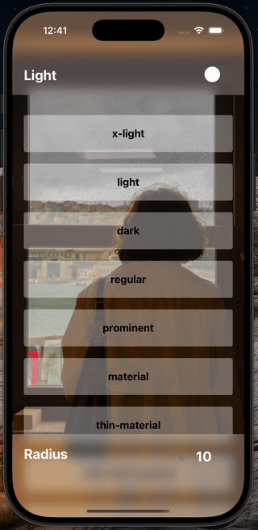

# `react-native-blur-view` 🌫️

A simple blur view in react native based in [`@react-native-community/blur`](https://github.com/Kureev/react-native-blur).


> [!WARNING]
> This package supports **only** [new architecture](https://reactnative.dev/blog/2024/10/23/the-new-architecture-is-here).

<p align="center">
  
  
</p>

## Summary

- [Installation](#installation)
- [Usage](#usage)
  - [Properties](#properties)
    - [Blur Types](#blur-types)
    - [Blur Types (Only iOS >= 10)](#blur-types-only-ios--10)
    - [Blur Types (Only iOS >= 13)](#blur-types-only-ios--13)
- [How BlurView works with and without children?](#how-blurview-works-with-and-without-children)
- [Expo](#expo)
- [Contributing](#contributing)
- [License](#license)

## Installation

```sh
npm install @danielsaraldi/react-native-blur-view
# or
yarn add @danielsaraldi/react-native-blur-view
```

Install native dependencies (**iOS only**):

```sh
cd ios && pod install
```

## Usage

```js
import { BlurView } from '@danielsaraldi/react-native-blur-view';

// ...

return (
  <View style={styles.container}>
    <BlurView style={styles.blurView}>
      <Text style={styles.title}>BlurView</Text>
    </BlurView>
  </View>
);

export const styles = StyleSheet.create({
  container: {
    position: 'absolute',

    width: '100%',
    height: 256,
  },

  blurView: {
    width: '100%',
    height: 256,

    justifyContent: 'center',
    alignItems: 'center',
  },

  title: {
    fontSize: 24,
    fontWeight: 'bold',

    textAlign: 'center',
    textAlignVertical: 'center',
  },

  // ...
});
```

### Properties

The `BlurView` component is an extends the same properties of the a `View` component.

| Property       | Description                                          | Default                                                                       | Platform |
| -------------- | ---------------------------------------------------- | ----------------------------------------------------------------------------- | -------- |
| `type`         | Color type of the overlay.                           | `light`                                                                       | All      |
| `radius`       | Blur radius `0` - `100`.                             | `10`                                                                          | All      |
| `blurStyle`    | Style for the `BlurView` component.                  | `[{ zIndex: 9999, backgroundColor: 'transparent' }, StyleSheet.absoluteFill]` | iOS      |
| `contentStyle` | Style for the `BlurView` component children content. | `{ zIndex: 9999, position: 'absolute' }`                                      | iOS      |

By default, the style property is `{ zIndex: 9999, backgroundColor: 'transparent' }`.

In **Android**, you can use `style` to set blur style content.

An important detail, when a value less than `0` or greater than `100` are provided for `radius` property, the `radius` is clipped.

#### Blur Types

| Property  | Description                                                                    | Platform |
| --------- | ------------------------------------------------------------------------------ | -------- |
| `x-light` | The area of the view is lighter than the underlying view.                      | All      |
| `light`   | The area of the view is the same approximate lightness of the underlying view. | All      |
| `dark`    | The area of the view is darker than the underlying view.                       | All      |

#### Blur Types (Only iOS >= 10)

| Property    | Description                                                                             | Platform |
| ----------- | --------------------------------------------------------------------------------------- | -------- |
| `regular`   | A regular blur style that adapts to the user interface style.                           | iOS      |
| `prominent` | A blur style for making content more prominent that adapts to the user interface style. | iOS      |

#### Blur Types (Only iOS >= 13)

| Property                    | Description                                                                                             | Platform |
| --------------------------- | ------------------------------------------------------------------------------------------------------- | -------- |
| `chrome-material`           | An adaptable blur effect that creates the appearance of the system chrome.                              | iOS      |
| `material`                  | An adaptable blur effect that creates the appearance of a material with normal thickness.               | iOS      |
| `thick-material`            | An adaptable blur effect that creates the appearance of a material that’s thicker than normal.          | iOS      |
| `thin-material`             | An adaptable blur effect that creates the appearance of a thin material.                                | iOS      |
| `ultra-thin-material`       | An adaptable blur effect that creates the appearance of an ultra-thin material.                         | iOS      |
| `chrome-material-light`     | A blur effect that creates the appearance of the system chrome and is always light.                     | iOS      |
| `material-light`            | A blur effect that creates the appearance of a material with normal thickness and is always light.      | iOS      |
| `thick-material-light`      | A blur effect that creates the appearance of a material that’s thicker than normal and is always light. | iOS      |
| `thin-material-light`       | A blur effect that creates the appearance of a thin material and is always light.                       | iOS      |
| `ultra-thin-material-light` | A blur effect that creates the appearance of an ultra-thin material and is always light.                | iOS      |
| `chrome-material-dark`      | A blur effect that creates the appearance of the system chrome and is always dark.                      | iOS      |
| `material-dark`             | A blur effect that creates the appearance of a material with normal thickness and is always dark.       | iOS      |
| `thick-material-dark`       | A blur effect that creates the appearance of a material that’s thicker than normal and is always dark.  | iOS      |
| `thin-material-dark`        | A blur effect that creates the appearance of a thin material and is always dark.                        | iOS      |
| `ultra-thin-material-dark`  | A blur effect that creates the appearance of an ultra-thin material and is always dark.                 | iOS      |

## How `BlurView` works with and without children?

- **With children**: The blur effect is applied to the background behind the `BlurView`, while the children content remains sharp and visible on top.

```tsx
return (
  <View style={styles.container}>
    <BlurView style={styles.blurView}>
      <Text style={styles.title}>
        This text will appear above the blur effect, the blur effect doesn't
        applied about it.
      </Text>

      <Button title="Click me" />
    </BlurView>
  </View>
);
```

- **Without children**: The blur effect affects whatever content is rendered below or above the `BlurView` in the component tree.

```tsx
return (
  <>
    <BlurView style={styles.container} />

    <Text style={styles.title}>
      This text will be blurred when it be behind or above BlurView!
    </Text>
  </>
);
```

## Expo

In Expo, you need to convert to a [custom development build](https://docs.expo.dev/develop/development-builds/introduction/) or use [prebuild](https://docs.expo.dev/workflow/continuous-native-generation/). You can use also React Native without Expo.

## Contributing

See the [contributing guide](CONTRIBUTING.md) to learn how to contribute to the repository and the development workflow.

## License

MIT

---

Made with [create-react-native-library](https://github.com/callstack/react-native-builder-bob) and using the [BlurView](https://github.com/Dimezis/BlurView) library of the [Dimezis](https://github.com/Dimezis) on Android ❤️
